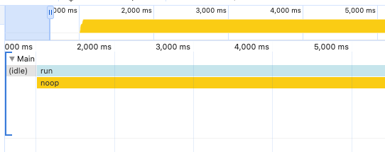
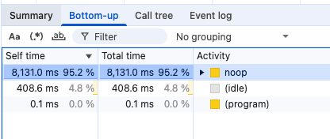

# node-addon-profile

This is a very simple Node addon that demonstrates issues profiling Node
native addons. Profiling misattributes time spent in native code to the
last JavaScript function exported rather than the actual method called.

## Build

```sh
make clean all
```

## Profile

```sh
node --inspect-brk index.js
```

Then open `chrome://inspect` in Chrome and start profiling.

* Click "Open dedicated DevTools for Node"
* Navigate to the "Performance" tab
* Click the record button (●)
* Wait a few seconds and end the profile

## Issue

https://github.com/nodejs/node/issues/59976

You **should** see the bulk of time being spent in `busyLoop`. However, all
time is spent in `noop`, despite this function never being called.



